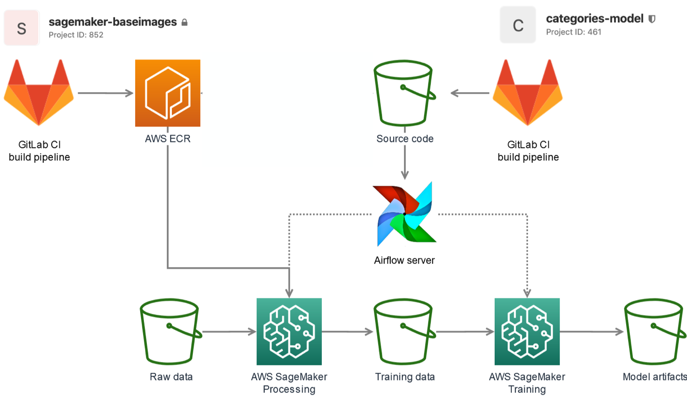
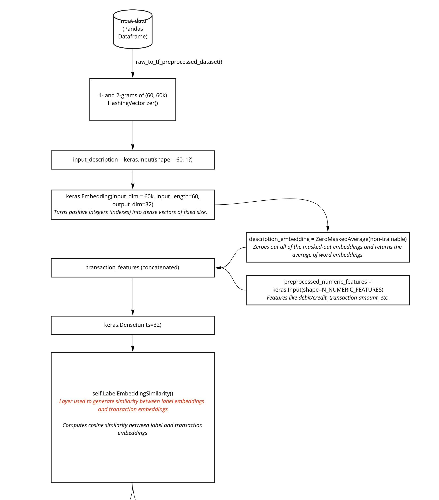
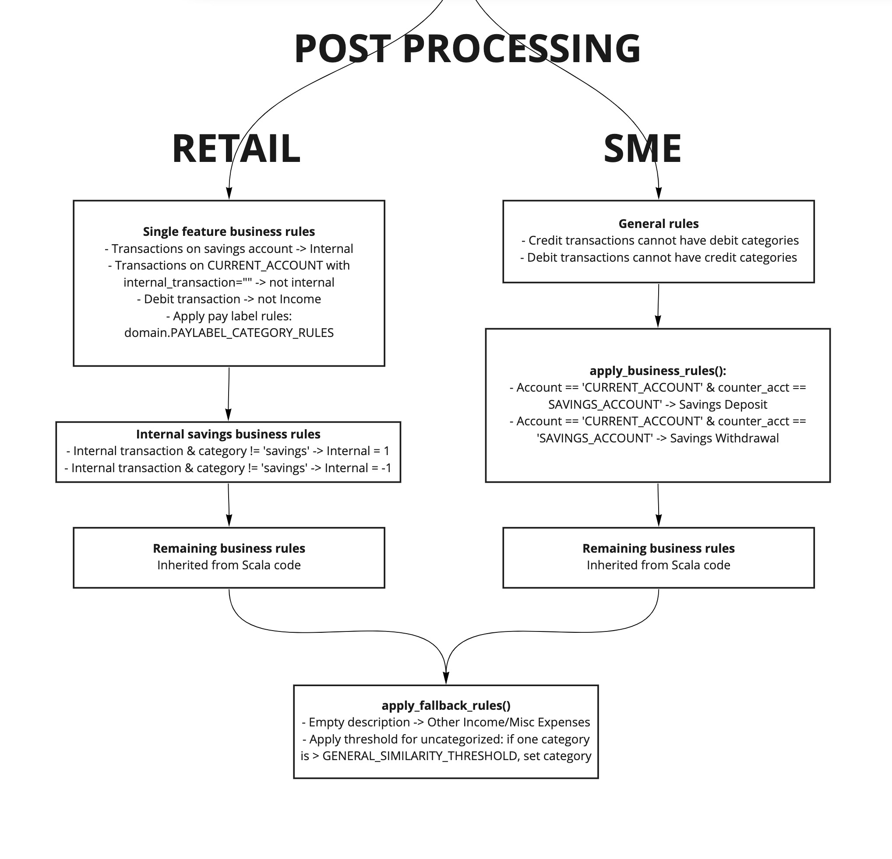
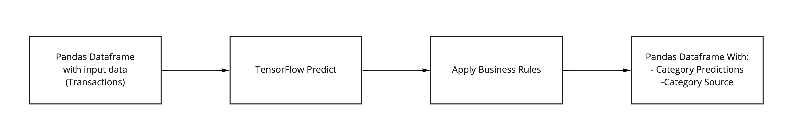

# Categories models


## Environment Setup

The current environment file is incomplete as it does not install the `tensorflow-text` package required for model training (which should be installed through .[training]).

To run tests locally then you must install `tensorflow-text` manually:
```
pip install tensorflow-text==2.9.0
```
as version `2.5.0` does not install properly due to python version dependencies

If you observe the following error when running pytest locally then you must update python to >=3.8 for the environment:
```
E       ValueError: Cell is empty

../../../opt/miniconda3/envs/categories_model_test7/lib/python3.7/site-packages/dill/_dill.py:1226: ValueError
```

Updating the package versions for these two packages in `environment.yaml` and `training_requirements.txt` does install the environment successfully and all tests also pass.

## For SME, there is an extra Preprocessing step - Training Data Generation

The categories models use information about a transaction (description,
amount, transaction_type (debit/credit), and internal_transaction) to
map a category to a transaction.


## Table of contents
- [Categories models](#categories-models)
  - [Environment Setup](#environment-setup)
  - [For SME, there is an extra Preprocessing step - Training Data Generation](#for-sme-there-is-an-extra-preprocessing-step---training-data-generation)
  - [Table of contents](#table-of-contents)
- [1. Categories models overview](#1-categories-models-overview)
  - [1.1 List of current Retail categories](#11-list-of-current-retail-categories)
  - [1.2 Table of current SME Categories](#12-table-of-current-sme-categories)
  - [1.3 Solution architecture for model training](#13-solution-architecture-for-model-training)
- [2. Preprocessing](#2-preprocessing)
  - [2.1 Training data](#21-training-data)
    - [Used Columns](#used-columns)
  - [2.2 For SME, there is an extra Preprocessing step - Training Data Generation](#22-for-sme-there-is-an-extra-preprocessing-step---training-data-generation)
- [3. Training algorithm](#3-training-algorithm)
  - [Important parameters](#important-parameters)
    - [General](#general)
    - [Retail vs SME](#retail-vs-sme)
- [4. Inference (prediction)](#4-inference-prediction)
  - [4.1 Model categorisation pipeline (Pandas)](#41-model-categorisation-pipeline-pandas)
  - [4.2 Input/output specification](#42-inputoutput-specification)
    - [Model input:](#model-input)
    - [Model output Pandas Dataframe:](#model-output-pandas-dataframe)
  - [4.3 Postprocessing logic](#43-postprocessing-logic)
    - [Tensorflow Business logic](#tensorflow-business-logic)
      - [Retail Categories model](#retail-categories-model)
      - [SME Categories model](#sme-categories-model)
    - [Python (Pandas) business logic.](#python-pandas-business-logic)
      - [Tax business rules (SME only)](#tax-business-rules-sme-only)
        - [NL tax labels](#nl-tax-labels)
        - [UK tax labels](#uk-tax-labels)
    - [Counterparty Mapping (Kamaji)](#counterparty-mapping-kamaji)
- [5. Development guide](#5-development-guide)
  - [5.1 Code structure](#51-code-structure)
  - [5.2 Set-up local development environment](#52-set-up-local-development-environment)
  - [5.3 Local testing](#53-local-testing)
  - [5.4 Airflow testing](#54-airflow-testing)
  - [5.5 AWS testing](#55-aws-testing)
  - [5.6 S3 output structure](#56-s3-output-structure)

# 1. Categories models overview

Categories Model consists of two models aka use-cases:
 - **Categories Model**: This is the retail categorisation model with consumer (retail) categories
 - **SME Categories Model**: This is the SME categorisation model with Small Medium Enterprise oriented categories 
   The aim of this categorisation is to get a clear and comprehensive view on the main types of expenses and income.
   We're not trying to set up an exact match to (legal) accounting categories as they differ throughout the different countries 
   where YTS is active.
 
## 1.1 List of current Retail categories

- **Housing**: Spending towards housing interior, kitchen, and garden.
- **Personal care**: Spending towards health (such as pharmacies, drug
    stores, optician, and dentist) and beauty (such as beauty stores and
    hairdresser).
- **Groceries**: Spending towards daily groceries.
- **Eating Out**: Spending towards restaurants.
- **Shopping**: Spending towards clothing stores and online
    marketplaces.
- **Travel**: Spending towards flights, long distance trains, and
    hotels.
- **Transport**: Spending towards public transport, taxi services,
    rental cars, and parking.
- **Bills**: Spending towards insurances, subscriptions, interest
    payments, account fees, and transfer fees.
- **Transfers**: Money transferred to unknown or private parties and
    international money transfers.
- **Cash**: ATM Cash Withdrawals.
- **Leisure**: Spending towards gaming, streaming services, betting,
    museums, concert tickets, and sports.
- **Internal**: Money transferred to an account owned by the sender.
- **Income**: Money received in the form of salary, refunds, or
    interest earned.
- **Charity**: Money transferred to charity organizations, political
    parties, and religious institutes.
- **Coffee**: Spending towards coffee shops.
- **Drinks**: Spending towards bars, pubs, and clubs.
- **Education**: Spending towards tuition fees, personal development,
    and book shops.
- **Expenses**: Business expenses.
- **Investments**: Payments to and earnings from investments.
- **Lunch**: Spending at lunch rooms, delis, and cafeterias.
- **Gifts**: Spending towards flower shops, postcard shops,
    chocolateries, and gift shops.
- **Kids**: Spending towards toy stores, pocket money, child care, and
    schools.
- **Takeaway**: Spending towards fast food restaurants and food
    delivery services.
- **Petrol**: Spending towards gas stations and electric car charging
    stations.
- **Rent**: Money paid to land lords and housing associations.
- **Utilities**: Spending towards energy providers, mobile network
    operators, and tv providers.
- **Vehicle**: Spending towards car insurers, car financiers, and car
    repair companies.
- **Pets**: Spending towards pet insurers, veterinarians, and pet
    stores.
- **Savings**: Money transferred towards saving accounts.
- **Mortgage**:  Payment to a lender who financed real estate. 
- **General**: Transactions that do not fit in any other category.

## 1.2 Table of current SME Categories

| **Cashflow direction level** | **Category group level**  | **CFA aggregation level** | **Category in Dutch**                     | **SME Category Name**         | **Description**                                                                                                                                                                           |
| ---------------------------- | ------------------------- | ------------------------- | ----------------------------------------- | ----------------------------- | ----------------------------------------------------------------------------------------------------------------------------------------------------------------------------------------- |
| Expenses                     | Financing Expenses        | Financing Expenses        | Rente en aflossingen                      | Interest and Repayments       | Interest & paid on overdrafts, loans and hire purchase in relation to your business, as well as leasing payments                                                                          |
|                              |                           |                           | Investeringen                             | Investments                   | An investment is an asset or item acquired with the goal of generating income or appreciation.                                                                                            |
|                              | Operating Activities      | Other Operating Costs     | Eten en drinken                           | Food and drinks               | Expenses related to meals and drinks during eg office lunches/drinks, business travels or meetings.                                                                                       |
|                              |                           |                           | Autokosten                                | Vehicles and Driving Expenses | Expenses for the use of vehicles for business purposes. Includes business owners driving and employee driving.                                                                            |
|                              |                           |                           | Huisvestingskosten                        | Rent and Facilities           | Renting, leasing or purchasing a space to conduct your business is an ongoing expense that you pay monthly, quarterly or annually, depending on the arrangements you make.                |
|                              |                           |                           | Reiskosten                                | Travel Expenses               | Costs associated with traveling for the purpose of conducting business-related activities.                                                                                                |
|                              |                           |                           | Verkoopkosten                             | Marketing and Promotion       | Marketing, advertisement, or sales of a product or brand.                                                                                                                                 |
|                              |                           |                           | Overige Operationele Kosten               | Other Operating Costs         | Operating costs that do not fall in any off the specified categories in the Operating Activities category group (column 2 in this table).                                                 |
|                              |                           | Utilities                 | Nutsvoorzieningen                         | Utilities                     | Water, electricity, internet, telephony, heat etc. For business purposes.                                                                                                                 |
|                              |                           | Collection Costs          | Incassokosten                             | Collection Costs              | Costs being charged through a collection agency: [<u>Lijst met incassobureaus of deurwaarders</u>](https://www.incassobureau-info.nl/azindex.php)                                         |
|                              |                           | Salaries and Labour Costs | Pensioenbijdrage werkgever                | Pension Payments              | Employers contribution to pension payments                                                                                                                                                |
|                              |                           |                           | Personeelskosten                          | Salaries                      | All compensation costs incurred by an employer in connection with the employment by such employer of applicable personnel, including all payroll and benefits excluding pension payments. |
|                              | Corporate Savings Deposit | Corporate Savings Deposit | Storting Bedrijfsgerelateerde Spaargelden | Corporate Savings Deposit     | Deposit funds in corporate savings account.                                                                                                                                               |
|                              | Equity Withdrawal         | Equity Withdrawal         | Onttrekking Vermogen                      | Equity Withdrawal             | Withdrawal if funds from the business. This includes private savings deposits, dividend payment and other owners draws.                                                                   |
|                              | Tax Expenses              | Sales Tax                 | Omzetbelasting                            | Sales Tax                     | Tax paid to a governing body for the sales of certain goods and services.                                                                                                                 |
|                              |                           | Payroll Tax               | Loonbelasting                             | Payroll Tax                   | Tax that has been withheld from wage and paid to the Tax and Customs Administration.                                                                                                      |
|                              |                           | Corporate Income Tax      | Vennootschapsbelasting                    | Corporate Income Tax          | Public and private companies pay corporate income tax on their profits.                                                                                                                   |
|                              |                           | Unspecified Tax           | Overige belastingen                       | Unspecified Tax               | Tax expenses that do not fall in any other tax category or that could not be identified in any other tax category.                                                                        |
|                              | Uncategorised Cost        | Other Expenses            | Overige uitgaven                          | Other Expenses                | All expenses that do not fall into any other category.                                                                                                                                    |
| Income                       | Tax Income                | Tax Returns               | Belasting Ontvangsten                     | Tax Returns                   | Funds returned by tax authorities                                                                                                                                                         |
|                              | Financing Income          | Equity Financing          | Kapitaal                                  | Equity Financing              | Transfer personal funds to a business bank account.                                                                                                                                       |
|                              |                           | Loans                     | Leningen                                  | Loans                         | Funds obtained by loans.                                                                                                                                                                  |
|                              | Operational Income        | Revenue                   | Omzet                                     | Revenue                       | The total amount of income generated by the sale of goods or services related to the company's primary operations.                                                                        |
|                              | Uncategorised Income      | Other Income              | Overige Ontvangsten                       | Other Income                  | All income that does not fall in another category.                                                                                                                                        |


## 1.3 Solution architecture for model training

 - **Preprocessing**: Aggregate and convert data sources to training data
 - **Training**: Train StarSpace model core
 - **Inference (Predict)**: Predict Python module that includes additional business logic

The picture below represents the solution architecture of the original categories model. The current situation is still valid
up to the following differences:
- We do not use sagemaker-baseimages anymore, but use the [docker images from datascience-model-commons](https://git.yolt.io/datascience/datascience-model-commons/-/tree/master/docker)
- Model artifacts consist of tar files that include
  - Tensorflow saved model
  - Training metadata
  - Predict (inference) code
- The code in the model artifact can be loaded as Python model in [categories-serving](https://git.yolt.io/datascience/categories-group/categories-serving).

|  |
| :-------------------------------------------: |
|      **Figure 1: solution architecture**      |

# 2. Preprocessing

To prepare training data in general five data sources are aggregated (see [#2.1](#21-training-data)):
 - **users** (`country_code`), **accounts** (`account_type`) and **transactions** tables are joined into one view
 - **test_users** (`user_id`) are discarded for non NL users. All NL users were test users within Yolt, and as the app was never publically available in the Netherlands all NL users are test users and all test users are NL users. 
 - **feedback** (`category`) is joined into the view to have a training target. This comes both from synthetic (generated feedback) and feedback (categories) from users/other parties.

From this dataset a sample is taken that will be split in a train, test and validation dataset.

## 2.1 Training data

Both SME and retail categorisation models use the following datasets and data fields:

 - YoltApp:
   - users: `s3a://yolt-dp-prd-data/cassandra/full_dump/users/user`
   - accounts: `s3a://yolt-dp-prd-data/cassandra/full_dump/accounts/account`
   - transactions: `s3a://yolt-dp-prd-data/cassandra/full_dump/datascience/transactions`
   - test_users: `s3a://yolt-dp-prd-data/cassandra/views/experimental_users`
   - feedback:
     - user_multiple_feedback_applied: `s3a://yolt-dp-prd-data/kafka/views/datascienceEvents__flat_hashed/source__source=categories/type__name=UserMultipleFeedbackApplied`
     - user_multiple_feedback_created: `s3a://yolt-dp-prd-data/kafka/views/datascienceEvents__flat_hashed/source__source=categories/type__name=UserMultipleFeedbackCreated`
     - user_single_feedback_created: `s3a://yolt-dp-prd-data/kafka/views/datascienceEvents__flat_hashed/source__source=categories/type__name=UserSingleFeedbackCreated`
   - historical_feedback: `s3a://yolt-dp-prd-data/static/categories_model/historical_feedback/*`
 - YTS:
   - users: `s3a://yolt-dp-prd-data-yts/cassandra/full_dump/ycs_users/user`
   - accounts: `s3a://yolt-dp-prd-data-yts/cassandra/full_dump/ycs_accounts/account`
   - transactions: `s3a://yolt-dp-prd-data-yts/cassandra/full_dump/ycs_datascience/transactions`

### Used Columns
 - users (YoltApp + YTS):

| COLUMN         | VALUE  | DESCRIPTION                                                           |
| :------------- | :----- | :-------------------------------------------------------------------- |
| `id`           | String | Unique Yolt user ID                                                   |
| `country_code` | String | Country                                                               |
| `client_id`    | String | ClientID, identifier of client that users belong to e.g. YoltApp |

 - accounts (YoltApp + YTS):

| COLUMN    | VALUE   | DESCRIPTION                                     |
| :-------- | :------ | :---------------------------------------------- |
| `id`      | String  | Account identifier; join key with `users` table |
| `deleted` | Boolean | Indicator whether an account is deleted         |
| `user_id` | String  | Unique Yolt user ID                             |

 - test_users (YoltApp):

| COLUMN    | VALUE  | DESCRIPTION                                         |
| :-------- | :----- | :-------------------------------------------------- |
| `user_id` | String | Unique Yolt user ID that belongs to Yolt test users |

 - transactions (YoltApp + YTS):

| COLUMN                   | VALUE   | DESCRIPTION                                                                          |
| :----------------------- | :------ | :----------------------------------------------------------------------------------- |
| `user_id`                | String  | Unique Yolt user ID                                                                  |
| `account_id`             | String  | Unique Yolt account ID                                                               |
| `transaction_id`         | String  | Unique Yolt transaction ID                                                           |
| `pending`                | Integer | Referring to "status", 1=REGULAR, 2=PENDING (see PENDING or REGULAR)                 |
| `date`                   | String  | Date of the transaction                                                              |
| `description`            | String  | Transaction description                                                              |
| `bank_counterparty_name` | String  | Description part that contains counterparty (this is not the Merchant model output!) |
| `transaction_type`       | String  | Transaction type: debit or credit                                                    |
| `internal_transaction`   | String  | ID for internal transactions                                                         |

 - historical_feedback (YoltApp):

| COLUMN           | VALUE   | DESCRIPTION                                                          |
| :--------------- | :------ | :------------------------------------------------------------------- |
| `user_id`        | String  | Unique Yolt user ID                                                  |
| `account_id`     | String  | Unique Yolt account ID                                               |
| `transaction_id` | String  | Unique Yolt transaction ID                                           |
| `pending`        | Integer | Referring to "status", 1=REGULAR, 2=PENDING (see PENDING or REGULAR) |
| `date`           | String  | Date of the transaction                                              |
| `feedback_time`  | String  | Date when user feedback was given                                    |
| `category`       | String  | Category provided by the user                                        |

 - user_feedback:
   - user_multiple_feedback_applied
   - user_multiple_feedback_created
   - user_single_feedback_created
 
| COLUMN             | VALUE   | DESCRIPTION                                                          |
| :----------------- | :------ | :------------------------------------------------------------------- |
| `id.userId`        | String  | Unique Yolt user ID                                                  |
| `id.accountId`     | String  | Unique Yolt account ID                                               |
| `id.transactionId` | String  | Unique Yolt transaction ID                                           |
| `id.pendingType`   | Integer | Referring to "status", 1=REGULAR, 2=PENDING (see PENDING or REGULAR) |
| `id.localDate`     | String  | Date of the transaction                                              |
| `time`             | String  | Date when user feedback was given                                    |
| `fact.category`    | String  | Category provided by the user                                        |

## 2.2 For SME, there is an extra Preprocessing step - Training Data Generation

The `/preprocessing` within `categories_model`, is both responsible for

1. Training Data **Generation** with **rules**, defined in `create_training_data.py`, `domain_data.py`, and `yts_rules.py`. 
2. Preprocessing as ussual, like any other model.

For **each** preprocessing, the training data is **regenerated**.

# 3. Training algorithm

The core is based on StarSpace. An overview of the architecture is in [this Miro board](https://miro.com/app/board/uXjVO4K25AU=/) and is further detailed in the [original paper](https://arxiv.org/pdf/1709.03856.pdf). An interesting blog providing a simpler overview is located [here.](https://medium.com/@pavan.11.1987/embedding-all-things-with-starspace-and-keras-1df46e4db8f0)

Starspace is a model that embeds concepts in an n-dimensional embedding space. This embedding space can then be used to store transactions and evaluate the (cosine) similarity of concepts; transaction categories in this case. 

Our implementation of Starspace for transaction categorization is mostly in ```categories_model/training/model.py```. The internal method ```_build_model()``` defines the model architecture, which is made up of the following components:

|  |
| :-----------------------------------------------: |
|            **Figure 2 StarSpace Core**            |

- An input layer that takes 1- and 2-grams of the transactions as generated by a [HashingVectorizer](https://scikit-learn.org/stable/modules/generated/sklearn.feature_extraction.text.HashingVectorizer.html)
- [An Embedding layer from Keras](https://keras.io/api/layers/core_layers/embedding/), which is where the actual embedding happens. The input dimension of this layer is 60k, meaning that we use a vocabulary of 60k words with a maximum input length of 60. The embedding layer converts this to a dense embedding with a dimension of (32, 1). 
- We apply a zero-masked average to the output of this embedding layer and concatenate it with the numeric features like transaction amount, etc. 
- These concatenated outputs are fed into a fully connected layer of 32 neurons.
- We apply the custom-written method ```LabelEmbeddingSimilarity()``` to this. This method computes the similarity of the output to the pre-defined label embeddings by taking the dot product of the two matrices. 

After the StarSpace core has trained a set of TensorFlow postprocessing layers is added to the model.
The trained model is saved in TensorFlow saved-model format including the postprocessing layers.
Each model (Retail/SME) is saved with the corresponding postprocessing layer.

|  |
| :----------------------------------------------------------------------: |
|              **Figure 3 Tensorflow Post-processing layers**              |

When the similarity of two classes as computed by ```LabelEmbeddingSimilarity``` exceeds a pre-defined threshold that differs for retail and SME categories (see table), the corresponding category is assigned as such if there is no category assigned by the business rules in postprocessing. 

## Important parameters

### General
These are some of the general training parameters as defined in  [```~/categories_model/config/```](./categories_model/config). 
|    Parameter     | Value |
| :--------------: | :---: |
| Validation set % |  10%  |
|    Test set %    |  10%  |
|    Batch size    |  512  |
|    Max epochs    |  40   |
|  Learning rate   | 0.01  |

### Retail vs SME

We employ two different models for retail and SME categories. The differences are mostly in a few parameters and a different set of business rules. The different categories are defined in [```training/retail.py ```](categories_model/training/retail.py) and [```training/sme.py```](categories_model/training/sme.py) along with explanation in [4.3 Postprocessing logic](#43-postprocessing-logic). The ```config/```-folder contains additional parameters that differ between [Retail](categories_model/config/retail.py) and [SME](categories_model/config/sme.py), the most important of which is the threshold that determine the minimal similarity score for a category to be assigned:

| Retail |  SME  |
| :----: | :---: |
|  0.65  | 0.45  |


# 4. Inference (prediction)

A trained model is stored as a model.tar.gz artifact on s3. This artifact includes:
- The trained StarSpace mode (TensorFlow SavedModel)
- Training metadata (`training_metadata.yaml`) file (the prediction categories can be extracted from that data)
- Prediction Python code as Python model.

As the model is offered in a Python module, the model can be loaded and used in categories-model-serving (production inference) and in Jupyter Notebook (analysis).

## 4.1 Model categorisation pipeline (Pandas)

Currently, the prediction package consists of two layers:
1. The prediction code accepts a Pandas Dataframe and offers that to
the Tensorflow model
   1. For this purpose Pandas is converted into Tenforflow Format
   2. The tensorflow model includes [Tensorflow Based postprocessing logic](#tensorflow-business-logic).
   3. The TensorFlow predictions are converted to Pandas columns (see [Model Output](#)).
      - `categories`
      - `category_source`
2. [Additional Pandas based business rules](#python-pandas-business-logic) are applied on the TensorFlow predictions including:
   - Tax business rules.
   
|  |
| :-------------------------------------------------------------: |
|         **Figure 4: Inference/model prediction steps**          |

## 4.2 Input/output specification

The model artifact offers a Python predict module that can determine categories from transaction input.

### Model input:

| COLUMN                     | VALUE  | DESCRIPTION                                                                                     |
| :------------------------- | :----- | :---------------------------------------------------------------------------------------------- |
| `description`              | String | Raw transaction description                                                                     |
| `amount`                   | Float  | Raw transaction amount                                                                          |
| `internal_transaction`     | String | ID for internal transactions                                                                    |
| `transaction_type`         | String | 'credit' or 'debit'                                                                             |
| `account_type`             | String | Account type of the transactions account. Values: 'CURRENT_ACCOUNT' or 'SAVINGS_ACCOUNT'        |
| `bank_specific__paylabels` | String | Pay labels extracted from the raw bank_specific field; the extraction is done in categories POD |
| `bank_specific__mcc`       | String | mcc extracted from the raw bank_specific field; the extraction is done in categories POD        |
| `counter_account_type`     | String | Account type of transactions counter account. Values: 'CURRENT_ACCOUNT' or 'SAVINGS_ACCOUNT'    |
| `bank_counterparty_name`   | String | Part of the transaction description that contains counterparty name (applicable to YTS data)    |
| `bank_counterparty_iban`   | String | Used in tax business rules (match Belastingdienst) in SME cagtegories model                     |

### Model output Pandas Dataframe:

| COLUMN            | VALUE  | DESCRIPTION                                           |
| :---------------- | :----- | :---------------------------------------------------- |
| `categories`      | String | Array of category predictions of the model            |
| `category_source` | String | Category source: 'ModelPrediction' or 'ModelFallback' |


## 4.3 Postprocessing logic
### Tensorflow Business logic
The model outputs are post-processed with business logic. Overview (in
order):

#### Retail Categories model
These rules are implemented in the [Retail Tensorflow postprocessing rules](./categories_model/training/retail.py):
- Transactions on SAVINGS account type are considered Internal
- Transactions on CURRENT_ACCOUNT with empty internal_transaction cannot be Internal
- Debit transactions cannot be Income
- If pay label is present, then category is dictated by Money League
    team. See: <a
    href="https://yolt.atlassian.net/wiki/spaces/LOV/pages/3910832/Transactions+descriptions+and+labels"
    data-card-appearance="inline">https://yolt.atlassian.net/wiki/spaces/LOV/pages/3910832/Transactions+descriptions+and+labels</a>
    Note that this table is not necessarily in sync with the code in
    production!
- If a transaction happens on a savings account (both credit and
    debit), the category is Internal
- If we know the counter account is a savings account, then the
    category is Savings
- For a current account, if we do not know the counter account type:
    - If predicted category is Savings, then category is Savings
    - Else, if internal transaction ID, then category is Internal
- If transaction contains a [known MCC code](./categories_model/training/mcc_codes.csv) then use that category
- If predicted category model confidence is below threshold, then
    category is General

#### SME Categories model
These rules are implemented in the [SME Tensorflow postprocessing rules](./categories_model/training/sme.py):
- Credit transactions cannot have debit categories
- Debit transaction cannor have credit categories
- if the account_type equals "CURRENT_ACCOUNT" and counter_account_type equals "SAVINGS_ACCOUNT"
  then category should be Savings Deposit for debit transactions
- If the account_type equals "CURRENT_ACCOUNT" and counter_account_type equals "SAVINGS_ACCOUNT"
  then category should be Savings Withdrawal for credit transactions
- If transaction type equals "debit" and cleaned description is empty then category should be Miscellaneous expenses
- If transaction type equals "credit" and cleaned description is empty then category should be Other Income

### Python (Pandas) business logic.

Currently the Python based business logic includes Tax business rules.

#### Tax business rules (SME only)
For the SME categories model we extract tax labels using the [datascience_model_commons tax rules library](https://git.yolt.io/datascience/datascience-model-commons/-/tree/master/datascience_model_commons/transactions/business_rules).
The resulting labels are mapped using [tax_config.yaml](./categories_model/predict/tax_config.yaml):
##### NL tax labels
 - **Debit-transaction label mapping:**

| Tax Label                                 | SME Category         |
| :---------------------------------------- | :------------------- |
| Acceptgiro                                | Unspecified Tax      |
| Dividendbelasting                         | Unspecified Tax      |
| Fijnstoftoeslag                           | Unspecified Tax      |
| Inkomsten_belasting                       | Unspecified Tax      |
| Inkomstenbelasting                        | Unspecified Tax      |
| Douanebelasting                           | Unspecified Tax      |
| Overige                                   | Unspecified Tax      |
| Inkomstenbelasting_gemoedbezwaarden       | Unspecified Tax      |
| Inkomstenbelasting_premievolksverzekering | Unspecified Tax      |
| Loon_belasting                            | Payroll Tax          |
| Loonbelasting                             | Payroll Tax          |
| Loonbelasting_naheffing                   | Payroll Tax          |
| Motorrijtuigenbelasting                   | Unspecified Tax      |
| Motorrijtuigenbelasting_naheffing         | Unspecified Tax      |
| Omzetbelasting                            | Sales Tax            |
| Omzetbelasting_naheffing                  | Sales Tax            |
| Other                                     | Unspecified Tax      |
| Toeslag                                   | Unspecified Tax      |
| Venootschapsbelasting                     | Corporate Income Tax |
| Voorlopige_belasting                      | Unspecified Tax      |
| Zorgverzekeringswet                       | Unspecified Tax      |

 - **Credit-transaction label mapping:**

| Tax Label                 | SME Category |
| :------------------------ | :----------- |
| Dividendbelasting         | Tax Returns  |
| Loon_belasting            | Tax Returns  |
| Loonbelasting             | Tax Returns  |
| Loonbelasting_naheffing   | Tax Returns  |
| Motorrijtuigenbelasting   | Tax Returns  |
| Omzetbelasting            | Tax Returns  |
| Other                     | Other Income |
| Toeslag                   | Other Income |
| Venootschapsbelasting     | Tax Returns  |
| Voorlopige_belasting      | Tax Returns  |
| Zorgverzekeringswet       | Other Income |
| Douanebelasting           | Tax Returns  |
| Overige                   | Other Income |
| Inkomstenbelasting        | Other Income |
| Milieu_investeringsaftrek | Other Income |

##### UK tax labels
 - **Debit-transaction label mapping:**

| Tax Label           | SME Category         |
| :------------------ | :------------------- |
| Self_assessment_tax | Unspecified Tax      |
| Corporate_tax       | Corporate Income Tax |
| VAT                 | Sales Tax            |
| Vehicle_tax         | Unspecified Tax      |
| Council_tax         | Unspecified Tax      |

 - **Credit-transaction label mapping:**

| Tax Label          | SME Category    |
| :----------------- | :-------------- |
| Child_benefit      | Other Income    |
| Child_tax_credit   | Unspecified Tax |
| Working_tax_credit | Other Income    |

### Counterparty Mapping (Kamaji)
Kamaji is a module that is applied after [prediction postprocessing business rules](./categories_model/predict/sme.py). This is applied to any transactions that have a `null` category after the probabilistic model and other business rules have been applied.

|  |
| :-------------------------------------------: |
|      **Figure 5: Kamaji from Spirited Away**      |

Like the multi-armed Kamaji, the code implemented in [arms_of_kamaji.py](./categories_model/predict/arms_of_kamaji.py) uses the data map defined in [mapping_dictionary.py](./categories_model/predict/mapping_dictionary.py) to manually map counterparties to the correct categories. The mapping dictionary contains cherry-picked counterparties (the top most important/frequent counterparties found in the transactions data) to map to categories (e.g. `"Eating Out": ["McDonalds"]`).


# 5. Development guide
## 5.1 Code structure
 - `/`: Project root
   - `yds_categories.yaml`: Retail Categories model YDS cli config
   - `yds_sme_categories.yaml`: SME Categories model YDS cli config
   - `/categories_model`: This is the main Python package code for categories_model
     - `/config`: This contains the configuration files for
       - Retail categories model: [`retail.py`](./categories_model/config/retail.py)
       - SME categories model: [`sme.py`](./categories_model/config/sme.py)
     - `/predict`: This code is deployed in model serving and contains serving code for
       - Retail categories model: [`retail.py`](./categories_model/predict/retail.py)
       - SME categories model: [`sme.py`](./categories_model/predict/sme.py)
         - Tax labels to categories mapping: [`tax_config.yaml`](./categories_model/predict/tax_config.yaml)
     - `/preprocessing`: All code for preprocessing data into training data
     - `/training`: All code for training the tensorflow model
   - `/dags`: The Airflow DAG definition for ['categories_all_train'](./dags/categories_all_train_dag.py)
   - `/resources`: Additional resources connected to categories models and images used in this readme file
     - `/notebooks`:  for static training data generation
   - `/test`: All pytest unit test code for the categories models
     - `/categories_model`: Tests for retail categories model
     - `/sme_categories_model`: Test for sme categories model
     - `/resources`: all test data used for unit tests and for training the model on dta
       - Any changes in this data should be synchronized to `s3://yolt-dp-dta-datascience-categories-model/input/`
         and `yolt-dp-dta-datascience-yoltapp-yts-sme-categories-model/input/`:<br>
         (!) **Please note that currently both retail and sme categories model use the same test data!**
         ```
         aws s3 sync /test/resources s3://yolt-dp-dta-datascience-categories-model/input/
         aws s3 sync /test/resources s3://yolt-dp-dta-datascience-yoltapp-yts-sme-categories-model/input/
         ```

## 5.2 Set-up local development environment
This project runs in a conda environment. To start developing on your local machine you need to:
- clone this repo to your local computer
- create a conda environment by running

```
conda env create -f environment.yaml
conda activate categories_model
```

You should now be able to run pytest:

```
pytest
```

To test and run the model on aws please read the [yds client documentation on](https://git.yolt.io/datascience/datascience-model-commons/-/blob/master/README.md) 
 - Retail categories model uses [yds_categories.yaml](./yds_categories.yaml) as configuration  file
 - SME categories model uses [yds_sme_categories.yaml](./yds_sme_categories.yaml) as configuration  file


## 5.3 Local testing

1) First prepare/update your conda environment:
  - Create (for the first time): `conda env create -f environment.yaml`
  - Update: `conda env update -f environment.yaml`
  - [For Mac OS X: Prepare Spark & Java](https://yolt.atlassian.net/wiki/spaces/LOV/pages/3911199/Setup+Python+development+environment)

2) For testing run `pytest` in your development ide

## 5.4 Airflow testing

To test on airflow-dta simply create a branch with a green pipeline. After this pipeline has completed airflow-dta will
pick up and deploy code from the latest successful pipeline (any branch).
- Create a git branch and push to gitlab.
- Wait for the pipeline to become green.
- Wait for approx 1 minute to allow airflow-dta to pickup the latest code
- Trigger the model training DAG on Airflow.

## 5.5 AWS testing

Use the yds-cli from your local terminal for aws testing
  - Retail categories:
    - First run preprocessing: `yds -f -c dta yds_categories_model.yaml run -s preprocessing`
      this will launch the preprocessing job on aws and will return a six character deploy id
    - Next, after preprocessing completed run training: `yds -f -c dta yds_categories_model.yaml run -s training -did <deploy id from preprocessing job>`

## 5.6 S3 output structure
* `model_tag` - branch name from which the code is deployed
* `deploy_id` - pipeline id from which the code is deployed
* `git_user`  - git username of user executing (ggitlab if executed by gitlab+airflow)

```
├── code
│   └─── <model_tag>
│       └─── <git_user>
│           └─── <deploy_id>
│               ├─── preprocessing
│               │   └─── code files
│               └─── training
│                   └─── code files
└── run
    ├─── preprocessing
    │   └─── <model_tag>
    │       └─── <git_user>
    │           └─── <deploy_id>
    │               └─── output files   
    └─── training
        └─── <model_tag>
            └─── <git_user>
                └─── <deploy_id>
                    └─── output files   
```

Note that when training a model, we output:
- `model.tar.gz` - model artifacts together with the metadata:
  - tensorflow savedmodel
  - [predict python package code](./categories_model/predict)
  - metadata yaml file
  
